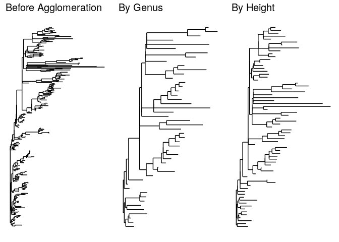

tutorial_phyloseq
================

``` r
library(dada2)
```

    ## Loading required package: Rcpp

``` r
library(phyloseq)
library(DECIPHER)
```

    ## Loading required package: Biostrings

    ## Loading required package: BiocGenerics

    ## 
    ## Attaching package: 'BiocGenerics'

    ## The following objects are masked from 'package:stats':
    ## 
    ##     IQR, mad, sd, var, xtabs

    ## The following objects are masked from 'package:base':
    ## 
    ##     anyDuplicated, append, as.data.frame, basename, cbind, colnames,
    ##     dirname, do.call, duplicated, eval, evalq, Filter, Find, get, grep,
    ##     grepl, intersect, is.unsorted, lapply, Map, mapply, match, mget,
    ##     order, paste, pmax, pmax.int, pmin, pmin.int, Position, rank,
    ##     rbind, Reduce, rownames, sapply, setdiff, sort, table, tapply,
    ##     union, unique, unsplit, which.max, which.min

    ## Loading required package: S4Vectors

    ## Loading required package: stats4

    ## 
    ## Attaching package: 'S4Vectors'

    ## The following objects are masked from 'package:base':
    ## 
    ##     expand.grid, I, unname

    ## Loading required package: IRanges

    ## 
    ## Attaching package: 'IRanges'

    ## The following object is masked from 'package:phyloseq':
    ## 
    ##     distance

    ## Loading required package: XVector

    ## Loading required package: GenomeInfoDb

    ## 
    ## Attaching package: 'Biostrings'

    ## The following object is masked from 'package:base':
    ## 
    ##     strsplit

    ## Loading required package: RSQLite

    ## Loading required package: parallel

``` r
library(phangorn)
```

    ## Loading required package: ape

    ## 
    ## Attaching package: 'ape'

    ## The following object is masked from 'package:Biostrings':
    ## 
    ##     complement

``` r
library(ggplot2)
library(gridExtra)
```

    ## 
    ## Attaching package: 'gridExtra'

    ## The following object is masked from 'package:BiocGenerics':
    ## 
    ##     combine

``` r
miseq_path <- "/home/rstudio/MiSeq_SOP"
list.files(miseq_path)
```

    ##  [1] "F3D0_S188_L001_R1_001.fastq"   "F3D0_S188_L001_R2_001.fastq"  
    ##  [3] "F3D1_S189_L001_R1_001.fastq"   "F3D1_S189_L001_R2_001.fastq"  
    ##  [5] "F3D141_S207_L001_R1_001.fastq" "F3D141_S207_L001_R2_001.fastq"
    ##  [7] "F3D142_S208_L001_R1_001.fastq" "F3D142_S208_L001_R2_001.fastq"
    ##  [9] "F3D143_S209_L001_R1_001.fastq" "F3D143_S209_L001_R2_001.fastq"
    ## [11] "F3D144_S210_L001_R1_001.fastq" "F3D144_S210_L001_R2_001.fastq"
    ## [13] "F3D145_S211_L001_R1_001.fastq" "F3D145_S211_L001_R2_001.fastq"
    ## [15] "F3D146_S212_L001_R1_001.fastq" "F3D146_S212_L001_R2_001.fastq"
    ## [17] "F3D147_S213_L001_R1_001.fastq" "F3D147_S213_L001_R2_001.fastq"
    ## [19] "F3D148_S214_L001_R1_001.fastq" "F3D148_S214_L001_R2_001.fastq"
    ## [21] "F3D149_S215_L001_R1_001.fastq" "F3D149_S215_L001_R2_001.fastq"
    ## [23] "F3D150_S216_L001_R1_001.fastq" "F3D150_S216_L001_R2_001.fastq"
    ## [25] "F3D2_S190_L001_R1_001.fastq"   "F3D2_S190_L001_R2_001.fastq"  
    ## [27] "F3D3_S191_L001_R1_001.fastq"   "F3D3_S191_L001_R2_001.fastq"  
    ## [29] "F3D5_S193_L001_R1_001.fastq"   "F3D5_S193_L001_R2_001.fastq"  
    ## [31] "F3D6_S194_L001_R1_001.fastq"   "F3D6_S194_L001_R2_001.fastq"  
    ## [33] "F3D7_S195_L001_R1_001.fastq"   "F3D7_S195_L001_R2_001.fastq"  
    ## [35] "F3D8_S196_L001_R1_001.fastq"   "F3D8_S196_L001_R2_001.fastq"  
    ## [37] "F3D9_S197_L001_R1_001.fastq"   "F3D9_S197_L001_R2_001.fastq"  
    ## [39] "filtered"                      "HMP_MOCK.v35.fasta"           
    ## [41] "Mock_S280_L001_R1_001.fastq"   "Mock_S280_L001_R2_001.fastq"  
    ## [43] "mouse.dpw.metadata"            "mouse.time.design"            
    ## [45] "stability.batch"               "stability.files"

``` r
# Sort ensures forward/reverse reads are in same order
fnFs <- sort(list.files(miseq_path, pattern="_R1_001.fastq"))
fnRs <- sort(list.files(miseq_path, pattern="_R2_001.fastq"))
# Extract sample names, assuming filenames have format: SAMPLENAME_XXX.fastq
sampleNames <- sapply(strsplit(fnFs, "_"), `[`, 1)
# Specify the full path to the fnFs and fnRs
fnFs <- file.path(miseq_path, fnFs)
fnRs <- file.path(miseq_path, fnRs)
fnFs[1:3]
```

    ## [1] "/home/rstudio/MiSeq_SOP/F3D0_S188_L001_R1_001.fastq"  
    ## [2] "/home/rstudio/MiSeq_SOP/F3D1_S189_L001_R1_001.fastq"  
    ## [3] "/home/rstudio/MiSeq_SOP/F3D141_S207_L001_R1_001.fastq"

``` r
#qualite phylosec
plotQualityProfile(fnFs[1:2])
```

    ## Warning: `guides(<scale> = FALSE)` is deprecated. Please use `guides(<scale> =
    ## "none")` instead.

<!-- -->

``` r
plotQualityProfile(fnRs[1:2])
```

    ## Warning: `guides(<scale> = FALSE)` is deprecated. Please use `guides(<scale> =
    ## "none")` instead.

<!-- -->

``` r
filt_path <- file.path(miseq_path, "filtered") # Place filtered files in filtered/ subdirectory
if(!file_test("-d", filt_path)) dir.create(filt_path)
filtFs <- file.path(filt_path, paste0(sampleNames, "_F_filt.fastq.gz"))
filtRs <- file.path(filt_path, paste0(sampleNames, "_R_filt.fastq.gz"))
```

``` r
out <- filterAndTrim(fnFs, filtFs, fnRs, filtRs, truncLen=c(240,160),
              maxN=0, maxEE=c(2,2), truncQ=2, rm.phix=TRUE,
              compress=TRUE, multithread=TRUE) # On Windows set multithread=FALSE
head(out)
```

    ##                               reads.in reads.out
    ## F3D0_S188_L001_R1_001.fastq       7793      7113
    ## F3D1_S189_L001_R1_001.fastq       5869      5299
    ## F3D141_S207_L001_R1_001.fastq     5958      5463
    ## F3D142_S208_L001_R1_001.fastq     3183      2914
    ## F3D143_S209_L001_R1_001.fastq     3178      2941
    ## F3D144_S210_L001_R1_001.fastq     4827      4312

``` r
derepFs <- derepFastq(filtFs, verbose=TRUE)
```

    ## Dereplicating sequence entries in Fastq file: /home/rstudio/MiSeq_SOP/filtered/F3D0_F_filt.fastq.gz

    ## Encountered 1979 unique sequences from 7113 total sequences read.

    ## Dereplicating sequence entries in Fastq file: /home/rstudio/MiSeq_SOP/filtered/F3D1_F_filt.fastq.gz

    ## Encountered 1639 unique sequences from 5299 total sequences read.

    ## Dereplicating sequence entries in Fastq file: /home/rstudio/MiSeq_SOP/filtered/F3D141_F_filt.fastq.gz

    ## Encountered 1477 unique sequences from 5463 total sequences read.

    ## Dereplicating sequence entries in Fastq file: /home/rstudio/MiSeq_SOP/filtered/F3D142_F_filt.fastq.gz

    ## Encountered 904 unique sequences from 2914 total sequences read.

    ## Dereplicating sequence entries in Fastq file: /home/rstudio/MiSeq_SOP/filtered/F3D143_F_filt.fastq.gz

    ## Encountered 939 unique sequences from 2941 total sequences read.

    ## Dereplicating sequence entries in Fastq file: /home/rstudio/MiSeq_SOP/filtered/F3D144_F_filt.fastq.gz

    ## Encountered 1267 unique sequences from 4312 total sequences read.

    ## Dereplicating sequence entries in Fastq file: /home/rstudio/MiSeq_SOP/filtered/F3D145_F_filt.fastq.gz

    ## Encountered 1756 unique sequences from 6741 total sequences read.

    ## Dereplicating sequence entries in Fastq file: /home/rstudio/MiSeq_SOP/filtered/F3D146_F_filt.fastq.gz

    ## Encountered 1438 unique sequences from 4560 total sequences read.

    ## Dereplicating sequence entries in Fastq file: /home/rstudio/MiSeq_SOP/filtered/F3D147_F_filt.fastq.gz

    ## Encountered 3590 unique sequences from 15637 total sequences read.

    ## Dereplicating sequence entries in Fastq file: /home/rstudio/MiSeq_SOP/filtered/F3D148_F_filt.fastq.gz

    ## Encountered 2762 unique sequences from 11413 total sequences read.

    ## Dereplicating sequence entries in Fastq file: /home/rstudio/MiSeq_SOP/filtered/F3D149_F_filt.fastq.gz

    ## Encountered 3021 unique sequences from 12017 total sequences read.

    ## Dereplicating sequence entries in Fastq file: /home/rstudio/MiSeq_SOP/filtered/F3D150_F_filt.fastq.gz

    ## Encountered 1566 unique sequences from 5032 total sequences read.

    ## Dereplicating sequence entries in Fastq file: /home/rstudio/MiSeq_SOP/filtered/F3D2_F_filt.fastq.gz

    ## Encountered 3707 unique sequences from 18075 total sequences read.

    ## Dereplicating sequence entries in Fastq file: /home/rstudio/MiSeq_SOP/filtered/F3D3_F_filt.fastq.gz

    ## Encountered 1479 unique sequences from 6250 total sequences read.

    ## Dereplicating sequence entries in Fastq file: /home/rstudio/MiSeq_SOP/filtered/F3D5_F_filt.fastq.gz

    ## Encountered 1195 unique sequences from 4052 total sequences read.

    ## Dereplicating sequence entries in Fastq file: /home/rstudio/MiSeq_SOP/filtered/F3D6_F_filt.fastq.gz

    ## Encountered 1832 unique sequences from 7369 total sequences read.

    ## Dereplicating sequence entries in Fastq file: /home/rstudio/MiSeq_SOP/filtered/F3D7_F_filt.fastq.gz

    ## Encountered 1183 unique sequences from 4765 total sequences read.

    ## Dereplicating sequence entries in Fastq file: /home/rstudio/MiSeq_SOP/filtered/F3D8_F_filt.fastq.gz

    ## Encountered 1382 unique sequences from 4871 total sequences read.

    ## Dereplicating sequence entries in Fastq file: /home/rstudio/MiSeq_SOP/filtered/F3D9_F_filt.fastq.gz

    ## Encountered 1709 unique sequences from 6504 total sequences read.

    ## Dereplicating sequence entries in Fastq file: /home/rstudio/MiSeq_SOP/filtered/Mock_F_filt.fastq.gz

    ## Encountered 897 unique sequences from 4314 total sequences read.

``` r
derepRs <- derepFastq(filtRs, verbose=TRUE)
```

    ## Dereplicating sequence entries in Fastq file: /home/rstudio/MiSeq_SOP/filtered/F3D0_R_filt.fastq.gz

    ## Encountered 1660 unique sequences from 7113 total sequences read.

    ## Dereplicating sequence entries in Fastq file: /home/rstudio/MiSeq_SOP/filtered/F3D1_R_filt.fastq.gz

    ## Encountered 1349 unique sequences from 5299 total sequences read.

    ## Dereplicating sequence entries in Fastq file: /home/rstudio/MiSeq_SOP/filtered/F3D141_R_filt.fastq.gz

    ## Encountered 1335 unique sequences from 5463 total sequences read.

    ## Dereplicating sequence entries in Fastq file: /home/rstudio/MiSeq_SOP/filtered/F3D142_R_filt.fastq.gz

    ## Encountered 853 unique sequences from 2914 total sequences read.

    ## Dereplicating sequence entries in Fastq file: /home/rstudio/MiSeq_SOP/filtered/F3D143_R_filt.fastq.gz

    ## Encountered 880 unique sequences from 2941 total sequences read.

    ## Dereplicating sequence entries in Fastq file: /home/rstudio/MiSeq_SOP/filtered/F3D144_R_filt.fastq.gz

    ## Encountered 1286 unique sequences from 4312 total sequences read.

    ## Dereplicating sequence entries in Fastq file: /home/rstudio/MiSeq_SOP/filtered/F3D145_R_filt.fastq.gz

    ## Encountered 1803 unique sequences from 6741 total sequences read.

    ## Dereplicating sequence entries in Fastq file: /home/rstudio/MiSeq_SOP/filtered/F3D146_R_filt.fastq.gz

    ## Encountered 1265 unique sequences from 4560 total sequences read.

    ## Dereplicating sequence entries in Fastq file: /home/rstudio/MiSeq_SOP/filtered/F3D147_R_filt.fastq.gz

    ## Encountered 3414 unique sequences from 15637 total sequences read.

    ## Dereplicating sequence entries in Fastq file: /home/rstudio/MiSeq_SOP/filtered/F3D148_R_filt.fastq.gz

    ## Encountered 2522 unique sequences from 11413 total sequences read.

    ## Dereplicating sequence entries in Fastq file: /home/rstudio/MiSeq_SOP/filtered/F3D149_R_filt.fastq.gz

    ## Encountered 2771 unique sequences from 12017 total sequences read.

    ## Dereplicating sequence entries in Fastq file: /home/rstudio/MiSeq_SOP/filtered/F3D150_R_filt.fastq.gz

    ## Encountered 1415 unique sequences from 5032 total sequences read.

    ## Dereplicating sequence entries in Fastq file: /home/rstudio/MiSeq_SOP/filtered/F3D2_R_filt.fastq.gz

    ## Encountered 3290 unique sequences from 18075 total sequences read.

    ## Dereplicating sequence entries in Fastq file: /home/rstudio/MiSeq_SOP/filtered/F3D3_R_filt.fastq.gz

    ## Encountered 1390 unique sequences from 6250 total sequences read.

    ## Dereplicating sequence entries in Fastq file: /home/rstudio/MiSeq_SOP/filtered/F3D5_R_filt.fastq.gz

    ## Encountered 1134 unique sequences from 4052 total sequences read.

    ## Dereplicating sequence entries in Fastq file: /home/rstudio/MiSeq_SOP/filtered/F3D6_R_filt.fastq.gz

    ## Encountered 1635 unique sequences from 7369 total sequences read.

    ## Dereplicating sequence entries in Fastq file: /home/rstudio/MiSeq_SOP/filtered/F3D7_R_filt.fastq.gz

    ## Encountered 1084 unique sequences from 4765 total sequences read.

    ## Dereplicating sequence entries in Fastq file: /home/rstudio/MiSeq_SOP/filtered/F3D8_R_filt.fastq.gz

    ## Encountered 1161 unique sequences from 4871 total sequences read.

    ## Dereplicating sequence entries in Fastq file: /home/rstudio/MiSeq_SOP/filtered/F3D9_R_filt.fastq.gz

    ## Encountered 1502 unique sequences from 6504 total sequences read.

    ## Dereplicating sequence entries in Fastq file: /home/rstudio/MiSeq_SOP/filtered/Mock_R_filt.fastq.gz

    ## Encountered 732 unique sequences from 4314 total sequences read.

``` r
# Name the derep-class objects by the sample names
names(derepFs) <- sampleNames
names(derepRs) <- sampleNames
```

``` r
errF <- learnErrors(filtFs, multithread=TRUE)
```

    ## 33514080 total bases in 139642 reads from 20 samples will be used for learning the error rates.

``` r
errR <- learnErrors(filtRs, multithread=TRUE)
```

    ## 22342720 total bases in 139642 reads from 20 samples will be used for learning the error rates.

``` r
plotErrors(errF)
```

    ## Warning: Transformation introduced infinite values in continuous y-axis

<!-- -->

``` r
plotErrors(errR)
```

    ## Warning: Transformation introduced infinite values in continuous y-axis

<!-- -->

``` r
dadaFs <- dada(derepFs, err=errF, multithread=TRUE)
```

    ## Sample 1 - 7113 reads in 1979 unique sequences.
    ## Sample 2 - 5299 reads in 1639 unique sequences.
    ## Sample 3 - 5463 reads in 1477 unique sequences.
    ## Sample 4 - 2914 reads in 904 unique sequences.
    ## Sample 5 - 2941 reads in 939 unique sequences.
    ## Sample 6 - 4312 reads in 1267 unique sequences.
    ## Sample 7 - 6741 reads in 1756 unique sequences.
    ## Sample 8 - 4560 reads in 1438 unique sequences.
    ## Sample 9 - 15637 reads in 3590 unique sequences.
    ## Sample 10 - 11413 reads in 2762 unique sequences.
    ## Sample 11 - 12017 reads in 3021 unique sequences.
    ## Sample 12 - 5032 reads in 1566 unique sequences.
    ## Sample 13 - 18075 reads in 3707 unique sequences.
    ## Sample 14 - 6250 reads in 1479 unique sequences.
    ## Sample 15 - 4052 reads in 1195 unique sequences.
    ## Sample 16 - 7369 reads in 1832 unique sequences.
    ## Sample 17 - 4765 reads in 1183 unique sequences.
    ## Sample 18 - 4871 reads in 1382 unique sequences.
    ## Sample 19 - 6504 reads in 1709 unique sequences.
    ## Sample 20 - 4314 reads in 897 unique sequences.

``` r
dadaRs <- dada(derepRs, err=errR, multithread=TRUE)
```

    ## Sample 1 - 7113 reads in 1660 unique sequences.
    ## Sample 2 - 5299 reads in 1349 unique sequences.
    ## Sample 3 - 5463 reads in 1335 unique sequences.
    ## Sample 4 - 2914 reads in 853 unique sequences.
    ## Sample 5 - 2941 reads in 880 unique sequences.
    ## Sample 6 - 4312 reads in 1286 unique sequences.
    ## Sample 7 - 6741 reads in 1803 unique sequences.
    ## Sample 8 - 4560 reads in 1265 unique sequences.
    ## Sample 9 - 15637 reads in 3414 unique sequences.
    ## Sample 10 - 11413 reads in 2522 unique sequences.
    ## Sample 11 - 12017 reads in 2771 unique sequences.
    ## Sample 12 - 5032 reads in 1415 unique sequences.
    ## Sample 13 - 18075 reads in 3290 unique sequences.
    ## Sample 14 - 6250 reads in 1390 unique sequences.
    ## Sample 15 - 4052 reads in 1134 unique sequences.
    ## Sample 16 - 7369 reads in 1635 unique sequences.
    ## Sample 17 - 4765 reads in 1084 unique sequences.
    ## Sample 18 - 4871 reads in 1161 unique sequences.
    ## Sample 19 - 6504 reads in 1502 unique sequences.
    ## Sample 20 - 4314 reads in 732 unique sequences.

``` r
dadaFs[[1]]
```

    ## dada-class: object describing DADA2 denoising results
    ## 128 sequence variants were inferred from 1979 input unique sequences.
    ## Key parameters: OMEGA_A = 1e-40, OMEGA_C = 1e-40, BAND_SIZE = 16

``` r
mergers <- mergePairs(dadaFs, derepFs, dadaRs, derepRs)
```

``` r
seqtabAll <- makeSequenceTable(mergers[!grepl("Mock", names(mergers))])
table(nchar(getSequences(seqtabAll)))
```

    ## 
    ## 251 252 253 254 255 
    ##   1  85 186   5   2

``` r
seqtabNoC <- removeBimeraDenovo(seqtabAll)
```

``` bash
cd ~
wget https://zenodo.org/record/801828/files/rdp_train_set_16.fa.gz
```

    ## --2022-12-14 18:58:14--  https://zenodo.org/record/801828/files/rdp_train_set_16.fa.gz
    ## Resolving zenodo.org (zenodo.org)... 188.185.124.72
    ## Connecting to zenodo.org (zenodo.org)|188.185.124.72|:443... connected.
    ## HTTP request sent, awaiting response... 200 OK
    ## Length: 3828450 (3.7M) [application/octet-stream]
    ## Saving to: ‘rdp_train_set_16.fa.gz.20’
    ## 
    ##      0K .......... .......... .......... .......... ..........  1%  929K 4s
    ##     50K .......... .......... .......... .......... ..........  2% 14.9M 2s
    ##    100K .......... .......... .......... .......... ..........  4% 15.0M 1s
    ##    150K .......... .......... .......... .......... ..........  5% 16.2M 1s
    ##    200K .......... .......... .......... .......... ..........  6% 86.5M 1s
    ##    250K .......... .......... .......... .......... ..........  8% 17.0M 1s
    ##    300K .......... .......... .......... .......... ..........  9% 71.3M 1s
    ##    350K .......... .......... .......... .......... .......... 10% 16.1M 1s
    ##    400K .......... .......... .......... .......... .......... 12% 84.0M 1s
    ##    450K .......... .......... .......... .......... .......... 13% 16.4M 0s
    ##    500K .......... .......... .......... .......... .......... 14% 64.9M 0s
    ##    550K .......... .......... .......... .......... .......... 16% 16.3M 0s
    ##    600K .......... .......... .......... .......... .......... 17% 69.7M 0s
    ##    650K .......... .......... .......... .......... .......... 18% 15.1M 0s
    ##    700K .......... .......... .......... .......... .......... 20% 65.2M 0s
    ##    750K .......... .......... .......... .......... .......... 21% 15.8M 0s
    ##    800K .......... .......... .......... .......... .......... 22% 17.0M 0s
    ##    850K .......... .......... .......... .......... .......... 24% 75.2M 0s
    ##    900K .......... .......... .......... .......... .......... 25% 12.7M 0s
    ##    950K .......... .......... .......... .......... .......... 26% 27.3M 0s
    ##   1000K .......... .......... .......... .......... .......... 28% 26.8M 0s
    ##   1050K .......... .......... .......... .......... .......... 29% 50.6M 0s
    ##   1100K .......... .......... .......... .......... .......... 30% 16.7M 0s
    ##   1150K .......... .......... .......... .......... .......... 32% 50.9M 0s
    ##   1200K .......... .......... .......... .......... .......... 33% 18.6M 0s
    ##   1250K .......... .......... .......... .......... .......... 34% 64.9M 0s
    ##   1300K .......... .......... .......... .......... .......... 36% 17.8M 0s
    ##   1350K .......... .......... .......... .......... .......... 37% 78.6M 0s
    ##   1400K .......... .......... .......... .......... .......... 38% 14.9M 0s
    ##   1450K .......... .......... .......... .......... .......... 40% 72.8M 0s
    ##   1500K .......... .......... .......... .......... .......... 41% 19.6M 0s
    ##   1550K .......... .......... .......... .......... .......... 42% 16.6M 0s
    ##   1600K .......... .......... .......... .......... .......... 44% 65.1M 0s
    ##   1650K .......... .......... .......... .......... .......... 45% 18.2M 0s
    ##   1700K .......... .......... .......... .......... .......... 46% 63.4M 0s
    ##   1750K .......... .......... .......... .......... .......... 48% 16.7M 0s
    ##   1800K .......... .......... .......... .......... .......... 49% 89.7M 0s
    ##   1850K .......... .......... .......... .......... .......... 50% 18.7M 0s
    ##   1900K .......... .......... .......... .......... .......... 52% 73.4M 0s
    ##   1950K .......... .......... .......... .......... .......... 53% 14.6M 0s
    ##   2000K .......... .......... .......... .......... .......... 54% 15.6M 0s
    ##   2050K .......... .......... .......... .......... .......... 56% 54.2M 0s
    ##   2100K .......... .......... .......... .......... .......... 57% 16.9M 0s
    ##   2150K .......... .......... .......... .......... .......... 58% 48.1M 0s
    ##   2200K .......... .......... .......... .......... .......... 60% 20.5M 0s
    ##   2250K .......... .......... .......... .......... .......... 61% 59.5M 0s
    ##   2300K .......... .......... .......... .......... .......... 62% 18.6M 0s
    ##   2350K .......... .......... .......... .......... .......... 64% 60.4M 0s
    ##   2400K .......... .......... .......... .......... .......... 65% 17.3M 0s
    ##   2450K .......... .......... .......... .......... .......... 66% 58.0M 0s
    ##   2500K .......... .......... .......... .......... .......... 68% 15.7M 0s
    ##   2550K .......... .......... .......... .......... .......... 69% 16.6M 0s
    ##   2600K .......... .......... .......... .......... .......... 70% 54.4M 0s
    ##   2650K .......... .......... .......... .......... .......... 72% 16.9M 0s
    ##   2700K .......... .......... .......... .......... .......... 73% 76.0M 0s
    ##   2750K .......... .......... .......... .......... .......... 74% 15.5M 0s
    ##   2800K .......... .......... .......... .......... .......... 76% 15.4M 0s
    ##   2850K .......... .......... .......... .......... .......... 77% 71.0M 0s
    ##   2900K .......... .......... .......... .......... .......... 78% 18.0M 0s
    ##   2950K .......... .......... .......... .......... .......... 80% 59.1M 0s
    ##   3000K .......... .......... .......... .......... .......... 81% 16.6M 0s
    ##   3050K .......... .......... .......... .......... .......... 82% 63.9M 0s
    ##   3100K .......... .......... .......... .......... .......... 84% 15.3M 0s
    ##   3150K .......... .......... .......... .......... .......... 85% 16.8M 0s
    ##   3200K .......... .......... .......... .......... .......... 86% 17.2M 0s
    ##   3250K .......... .......... .......... .......... .......... 88% 59.2M 0s
    ##   3300K .......... .......... .......... .......... .......... 89% 17.5M 0s
    ##   3350K .......... .......... .......... .......... .......... 90% 65.5M 0s
    ##   3400K .......... .......... .......... .......... .......... 92% 17.5M 0s
    ##   3450K .......... .......... .......... .......... .......... 93% 65.2M 0s
    ##   3500K .......... .......... .......... .......... .......... 94% 18.6M 0s
    ##   3550K .......... .......... .......... .......... .......... 96% 17.7M 0s
    ##   3600K .......... .......... .......... .......... .......... 97% 61.6M 0s
    ##   3650K .......... .......... .......... .......... .......... 98% 18.1M 0s
    ##   3700K .......... .......... .......... ........             100% 57.5M=0.2s
    ## 
    ## 2022-12-14 18:58:19 (18.1 MB/s) - ‘rdp_train_set_16.fa.gz.20’ saved [3828450/3828450]

``` r
fastaRef <- "/home/rstudio/rdp_train_set_16.fa.gz"
taxTab <- assignTaxonomy (seqtabNoC, refFasta = fastaRef, multithread=TRUE)
unname(head(taxTab))
```

    ##      [,1]       [,2]            [,3]          [,4]           
    ## [1,] "Bacteria" "Bacteroidetes" "Bacteroidia" "Bacteroidales"
    ## [2,] "Bacteria" "Bacteroidetes" "Bacteroidia" "Bacteroidales"
    ## [3,] "Bacteria" "Bacteroidetes" "Bacteroidia" "Bacteroidales"
    ## [4,] "Bacteria" "Bacteroidetes" "Bacteroidia" "Bacteroidales"
    ## [5,] "Bacteria" "Bacteroidetes" "Bacteroidia" "Bacteroidales"
    ## [6,] "Bacteria" "Bacteroidetes" "Bacteroidia" "Bacteroidales"
    ##      [,5]                 [,6]         
    ## [1,] "Porphyromonadaceae" NA           
    ## [2,] "Porphyromonadaceae" NA           
    ## [3,] "Porphyromonadaceae" NA           
    ## [4,] "Porphyromonadaceae" "Barnesiella"
    ## [5,] "Bacteroidaceae"     "Bacteroides"
    ## [6,] "Porphyromonadaceae" NA

``` r
seqs <- getSequences(seqtabNoC)
names(seqs) <- seqs # This propagates to the tip labels of the tree
alignment <- AlignSeqs(DNAStringSet(seqs), anchor=NA,verbose=FALSE)
```

``` r
phangAlign <- phyDat(as(alignment, "matrix"), type="DNA")
dm <- dist.ml(phangAlign)
treeNJ <- NJ(dm) # Note, tip order != sequence order
fit = pml(treeNJ, data=phangAlign)
fitGTR <- update(fit, k=4, inv=0.2)
fitGTR <- optim.pml(fitGTR, model="GTR", optInv=TRUE, optGamma=TRUE,
        rearrangement = "stochastic", control = pml.control(trace = 0))
detach("package:phangorn", unload=TRUE)
```

``` r
samdf <- read.csv("https://raw.githubusercontent.com/spholmes/F1000_workflow/master/data/MIMARKS_Data_combined.csv",header=TRUE)
samdf$SampleID <- paste0(gsub("00", "", samdf$host_subject_id), "D", samdf$age-21)
samdf <- samdf[!duplicated(samdf$SampleID),] # Remove dupicate entries for reverse reads
rownames(seqtabAll) <- gsub("124", "125", rownames(seqtabAll)) # Fix discrepancy
all(rownames(seqtabAll) %in% samdf$SampleID) # TRUE
```

    ## [1] TRUE

``` r
rownames(samdf) <- samdf$SampleID
keep.cols <- c("collection_date", "biome", "target_gene", "target_subfragment",
"host_common_name", "host_subject_id", "age", "sex", "body_product", "tot_mass",
"diet", "family_relationship", "genotype", "SampleID") 
samdf <- samdf[rownames(seqtabAll), keep.cols]
```

``` r
ps <- phyloseq(otu_table(seqtabNoC, taxa_are_rows=FALSE), 
               sample_data(samdf), 
               tax_table(taxTab),phy_tree(fitGTR$tree))
ps <- prune_samples(sample_names(ps) != "Mock", ps) # Remove mock sample
ps
```

    ## phyloseq-class experiment-level object
    ## otu_table()   OTU Table:         [ 218 taxa and 19 samples ]
    ## sample_data() Sample Data:       [ 19 samples by 14 sample variables ]
    ## tax_table()   Taxonomy Table:    [ 218 taxa by 6 taxonomic ranks ]
    ## phy_tree()    Phylogenetic Tree: [ 218 tips and 216 internal nodes ]

``` r
ps_connect <-url("https://raw.githubusercontent.com/spholmes/F1000_workflow/master/data/ps.rds")
ps = readRDS(ps_connect)
ps
```

    ## phyloseq-class experiment-level object
    ## otu_table()   OTU Table:         [ 389 taxa and 360 samples ]
    ## sample_data() Sample Data:       [ 360 samples by 14 sample variables ]
    ## tax_table()   Taxonomy Table:    [ 389 taxa by 6 taxonomic ranks ]
    ## phy_tree()    Phylogenetic Tree: [ 389 tips and 387 internal nodes ]

``` r
# Show available ranks in the dataset
rank_names(ps)
```

    ## [1] "Kingdom" "Phylum"  "Class"   "Order"   "Family"  "Genus"

``` r
# Create table, number of features for each phyla
table(tax_table(ps)[, "Phylum"], exclude = NULL)
```

    ## 
    ##              Actinobacteria               Bacteroidetes 
    ##                          13                          23 
    ## Candidatus_Saccharibacteria   Cyanobacteria/Chloroplast 
    ##                           1                           4 
    ##         Deinococcus-Thermus                  Firmicutes 
    ##                           1                         327 
    ##                Fusobacteria              Proteobacteria 
    ##                           1                          11 
    ##                 Tenericutes             Verrucomicrobia 
    ##                           1                           1 
    ##                        <NA> 
    ##                           6

``` r
# Compute prevalence of each feature, store as data.frame
prevdf = apply(X = otu_table(ps),
               MARGIN = ifelse(taxa_are_rows(ps), yes = 1, no = 2),
               FUN = function(x){sum(x > 0)})
# Add taxonomy and total read counts to this data.frame
prevdf = data.frame(Prevalence = prevdf,
                    TotalAbundance = taxa_sums(ps),
                    tax_table(ps))
```

``` r
plyr::ddply(prevdf, "Phylum", function(df1){cbind(mean(df1$Prevalence),sum(df1$Prevalence))})
```

    ##                         Phylum         1     2
    ## 1               Actinobacteria 120.15385  1562
    ## 2                Bacteroidetes 265.52174  6107
    ## 3  Candidatus_Saccharibacteria 280.00000   280
    ## 4    Cyanobacteria/Chloroplast  64.25000   257
    ## 5          Deinococcus-Thermus  52.00000    52
    ## 6                   Firmicutes 179.24771 58614
    ## 7                 Fusobacteria   2.00000     2
    ## 8               Proteobacteria  59.09091   650
    ## 9                  Tenericutes 234.00000   234
    ## 10             Verrucomicrobia 104.00000   104
    ## 11                        <NA> 169.50000  1017

``` r
# Define phyla to filter
filterPhyla = c("Fusobacteria", "Deinococcus-Thermus")
# Filter entries with unidentified Phylum.
ps1 = subset_taxa(ps, !Phylum %in% filterPhyla)
ps1
```

    ## phyloseq-class experiment-level object
    ## otu_table()   OTU Table:         [ 387 taxa and 360 samples ]
    ## sample_data() Sample Data:       [ 360 samples by 14 sample variables ]
    ## tax_table()   Taxonomy Table:    [ 387 taxa by 6 taxonomic ranks ]
    ## phy_tree()    Phylogenetic Tree: [ 387 tips and 385 internal nodes ]

``` r
#prevalence= nb d'echantillons dslesquels apparaissent les taxa
# Subset to the remaining phyla
prevdf1 = subset(prevdf, Phylum %in% get_taxa_unique(ps1, "Phylum"))
ggplot(prevdf1, aes(TotalAbundance, Prevalence / nsamples(ps),color=Phylum)) +
  # Include a guess for parameter
  geom_hline(yintercept = 0.05, alpha = 0.5, linetype = 2) +  geom_point(size = 2, alpha = 0.7) +
  scale_x_log10() +  xlab("Total Abundance") + ylab("Prevalence [Frac. Samples]") +
  facet_wrap(~Phylum) + theme(legend.position="none")
```

<!-- -->

``` r
# Define prevalence threshold as 5% of total samples
prevalenceThreshold = 0.05 * nsamples(ps)
prevalenceThreshold
```

    ## [1] 18

``` r
# Execute prevalence filter, using `prune_taxa()` function
keepTaxa = rownames(prevdf1)[(prevdf1$Prevalence >= prevalenceThreshold)]
ps2 = prune_taxa(keepTaxa, ps)
```

``` r
# How many genera would be present after filtering?
length(get_taxa_unique(ps2, taxonomic.rank = "Genus"))
```

    ## [1] 49

``` r
ps3 = tax_glom(ps2, "Genus", NArm = TRUE)
```

``` r
h1 = 0.4
ps4 = tip_glom(ps2, h = h1)
```

``` r
multiPlotTitleTextSize = 15
p2tree = plot_tree(ps2, method = "treeonly",
                   ladderize = "left",
                   title = "Before Agglomeration") +
  theme(plot.title = element_text(size = multiPlotTitleTextSize))
p3tree = plot_tree(ps3, method = "treeonly",
                   ladderize = "left", title = "By Genus") +
  theme(plot.title = element_text(size = multiPlotTitleTextSize))
p4tree = plot_tree(ps4, method = "treeonly",
                   ladderize = "left", title = "By Height") +
  theme(plot.title = element_text(size = multiPlotTitleTextSize))
```

``` r
# group plots together
# le denier graphe montre tout ceux qui st à meme dist (0.4)seront agglomerés ensemble ds un seul tiret
grid.arrange(nrow = 1, p2tree, p3tree, p4tree)
```

<!-- -->

``` r
#etape de normalisation
plot_abundance = function(physeq,title = "",
                          Facet = "Order", Color = "Phylum"){
  # Arbitrary subset, based on Phylum, for plotting
  p1f = subset_taxa(physeq, Phylum %in% c("Firmicutes"))
  mphyseq = psmelt(p1f)
  mphyseq <- subset(mphyseq, Abundance > 0)
  ggplot(data = mphyseq, mapping = aes_string(x = "sex",y = "Abundance",
                              color = Color, fill = Color)) +
    geom_violin(fill = NA) +
    geom_point(size = 1, alpha = 0.3,
               position = position_jitter(width = 0.3)) +
    facet_wrap(facets = Facet) + scale_y_log10()+
    theme(legend.position="none")
}
```

``` r
# Transform to relative abundance. Save as new object.
ps3ra = transform_sample_counts(ps3, function(x){x / sum(x)})
```

``` r
plotBefore = plot_abundance(ps3,"")
plotAfter = plot_abundance(ps3ra,"")
# Combine each plot into one graphic.
grid.arrange(nrow = 2,  plotBefore, plotAfter)
```

<!-- -->

``` r
#Subset by taxonomy
psOrd = subset_taxa(ps3ra, Order == "Lactobacillales")
plot_abundance(psOrd, Facet = "Genus", Color = NULL)
```

<!-- -->

``` r
library("shiny")
library("miniUI")
library("caret")
```

    ## Loading required package: lattice

``` r
library("pls")
```

    ## 
    ## Attaching package: 'pls'

    ## The following object is masked from 'package:caret':
    ## 
    ##     R2

    ## The following object is masked from 'package:ape':
    ## 
    ##     mvr

    ## The following object is masked from 'package:stats':
    ## 
    ##     loadings

``` r
library("e1071")
library("ggplot2")
library("randomForest")
```

    ## randomForest 4.7-1.1

    ## Type rfNews() to see new features/changes/bug fixes.

    ## 
    ## Attaching package: 'randomForest'

    ## The following object is masked from 'package:gridExtra':
    ## 
    ##     combine

    ## The following object is masked from 'package:ggplot2':
    ## 
    ##     margin

    ## The following object is masked from 'package:BiocGenerics':
    ## 
    ##     combine

``` r
library("dplyr")
```

    ## 
    ## Attaching package: 'dplyr'

    ## The following object is masked from 'package:randomForest':
    ## 
    ##     combine

    ## The following object is masked from 'package:gridExtra':
    ## 
    ##     combine

    ## The following objects are masked from 'package:Biostrings':
    ## 
    ##     collapse, intersect, setdiff, setequal, union

    ## The following object is masked from 'package:GenomeInfoDb':
    ## 
    ##     intersect

    ## The following object is masked from 'package:XVector':
    ## 
    ##     slice

    ## The following objects are masked from 'package:IRanges':
    ## 
    ##     collapse, desc, intersect, setdiff, slice, union

    ## The following objects are masked from 'package:S4Vectors':
    ## 
    ##     first, intersect, rename, setdiff, setequal, union

    ## The following objects are masked from 'package:BiocGenerics':
    ## 
    ##     combine, intersect, setdiff, union

    ## The following objects are masked from 'package:stats':
    ## 
    ##     filter, lag

    ## The following objects are masked from 'package:base':
    ## 
    ##     intersect, setdiff, setequal, union

``` r
library("ggrepel")
#library("nlme")
library("devtools")
```

    ## Loading required package: usethis

``` r
library("reshape2")
library("PMA")
#library("structSSI")
library("ade4")
```

    ## 
    ## Attaching package: 'ade4'

    ## The following object is masked from 'package:Biostrings':
    ## 
    ##     score

    ## The following object is masked from 'package:BiocGenerics':
    ## 
    ##     score

``` r
library("ggnetwork")
library("intergraph")
library("scales")
library("phyloseqGraphTest")
library("genefilter")
library("impute")
```

``` r
#Preprocessinggit
qplot(sample_data(ps)$age, geom = "histogram",binwidth=20) + xlab("age")
```

<!-- -->

``` r
qplot(log10(rowSums(otu_table(ps))),binwidth=0.2) +
  xlab("Logged counts-per-sample")
```

<!-- -->

``` r
sample_data(ps)$age_binned <- cut(sample_data(ps)$age,
                          breaks = c(0, 100, 200, 400))
levels(sample_data(ps)$age_binned) <- list(Young100="(0,100]", Mid100to200="(100,200]", Old200="(200,400]")
sample_data(ps)$family_relationship=gsub(" ","",sample_data(ps)$family_relationship)
pslog <- transform_sample_counts(ps, function(x) log(1 + x))
out.wuf.log <- ordinate(pslog, method = "MDS", distance = "wunifrac")
```

    ## Warning in UniFrac(physeq, weighted = TRUE, ...): Randomly assigning root as --
    ## GCAAGCGTTATCCGGATTTACTGGGTGTAAAGGGAGCGCAGACGGCTGTGCAAGTCTGGAGTGAAAGGCGGGGGCCCAACCCCTGGACTGCTCTGGAAACTGTAAAGCTGGAGTGCAGGAGAGGTAAGCGGAATTCCTAGTGTAGCGGTGAAATGCGTAGATATTAGGAGGAACACCAGTGGCGAAGGCGGCTTACTGGACTGCAACTGACGTTGAGGCTCGAAAGCGTGGGGAG
    ## -- in the phylogenetic tree in the data you provided.

``` r
evals <- out.wuf.log$values$Eigenvalues
plot_ordination(pslog, out.wuf.log, color = "age_binned") +
  labs(col = "Binned Age") +
  coord_fixed(sqrt(evals[2] / evals[1]))
```

<!-- -->

``` r
rel_abund <- t(apply(otu_table(ps), 1, function(x) x / sum(x)))
qplot(rel_abund[, 12], geom = "histogram",binwidth=0.05) +
  xlab("Relative abundance")
```

<!-- -->

``` r
#Different Ordination Projections
outliers <- c("F5D165", "F6D165", "M3D175", "M4D175", "M5D175", "M6D175")
ps <- prune_samples(!(sample_names(ps) %in% outliers), ps)
```

``` r
which(!rowSums(otu_table(ps)) > 1000)
```

    ## F5D145 M1D149   M1D9 M2D125  M2D19 M3D148 M3D149   M3D3   M3D5   M3D8 
    ##     69    185    200    204    218    243    244    252    256    260

``` r
ps <- prune_samples(rowSums(otu_table(ps)) > 1000, ps)
pslog <- transform_sample_counts(ps, function(x) log(1 + x))
```

``` r
out.pcoa.log <- ordinate(pslog,  method = "MDS", distance = "bray")
evals <- out.pcoa.log$values[,1]
plot_ordination(pslog, out.pcoa.log, color = "age_binned",
                  shape = "family_relationship") +
  labs(col = "Binned Age", shape = "Litter")+
  coord_fixed(sqrt(evals[2] / evals[1]))
```

<!-- -->

``` r
out.dpcoa.log <- ordinate(pslog, method = "DPCoA")
evals <- out.dpcoa.log$eig
plot_ordination(pslog, out.dpcoa.log, color = "age_binned", label= "SampleID",
                  shape = "family_relationship") +
  labs(col = "Binned Age", shape = "Litter")+
  coord_fixed(sqrt(evals[2] / evals[1]))
```

<!-- -->

``` r
plot_ordination(pslog, out.dpcoa.log, type = "species", color = "Phylum") +
  coord_fixed(sqrt(evals[2] / evals[1]))
```

<!-- -->

``` r
out.wuf.log <- ordinate(pslog, method = "PCoA", distance ="wunifrac")
```

    ## Warning in UniFrac(physeq, weighted = TRUE, ...): Randomly assigning root as --
    ## GCAAGCGTTATCCGGATTTACTGGGTGTAAAGGGAGCGTAGACGGCTGTGCAAGCCAGATGTGAAAGCCCGGGGCTCAACCCCGGGACTGCATTTGGAACTGTGTGGCTGGAGTGTCGGAGAGGCAGGCGGAATTCCTAGTGTAGCGGTGAAATGCGTAGATATTAGGAGGAACACCAGTGGCGAAGGCGGCCTGCTGGACGATGACTGACGTTGAGGCTCGAAAGCGTGGGGAG
    ## -- in the phylogenetic tree in the data you provided.

``` r
evals <- out.wuf.log$values$Eigenvalues
plot_ordination(pslog, out.wuf.log, color = "age_binned",
                  shape = "family_relationship") +
  coord_fixed(sqrt(evals[2] / evals[1])) +
  labs(col = "Binned Age", shape = "Litter")
```

<!-- -->

``` r
abund <- otu_table(pslog)
abund_ranks <- t(apply(abund, 1, rank))
```

``` r
#PCA on ranks
abund_ranks <- abund_ranks - 329
abund_ranks[abund_ranks < 1] <- 1
```

``` r
library(dplyr)
library(reshape2)
abund_df <- melt(abund, value.name = "abund") %>%
  left_join(melt(abund_ranks, value.name = "rank"))
```

    ## Joining, by = c("Var1", "Var2")

``` r
colnames(abund_df) <- c("sample", "seq", "abund", "rank")

abund_df <- melt(abund, value.name = "abund") %>%
  left_join(melt(abund_ranks, value.name = "rank"))
```

    ## Joining, by = c("Var1", "Var2")

``` r
colnames(abund_df) <- c("sample", "seq", "abund", "rank")

sample_ix <- sample(1:nrow(abund_df), 8)
ggplot(abund_df %>%
         filter(sample %in% abund_df$sample[sample_ix])) +
  geom_point(aes(x = abund, y = rank, col = sample),
             position = position_jitter(width = 0.2), size = 1.5) +
  labs(x = "Abundance", y = "Thresholded rank") +
  scale_color_brewer(palette = "Set2")
```

<!-- -->

``` r
library(ade4)
ranks_pca <- dudi.pca(abund_ranks, scannf = F, nf = 3)
row_scores <- data.frame(li = ranks_pca$li,
                         
                         SampleID = rownames(abund_ranks))
col_scores <- data.frame(co = ranks_pca$co,
                         seq = colnames(abund_ranks))
tax <- tax_table(ps) %>%
  data.frame(stringsAsFactors = FALSE)
tax$seq <- rownames(tax)
main_orders <- c("Clostridiales", "Bacteroidales", "Lactobacillales",
                 "Coriobacteriales")
tax$Order[!(tax$Order %in% main_orders)] <- "Other"
tax$Order <- factor(tax$Order, levels = c(main_orders, "Other"))
tax$otu_id <- seq_len(ncol(otu_table(ps)))
row_scores <- row_scores %>%
  left_join(sample_data(pslog))
```

    ## Joining, by = "SampleID"

``` r
col_scores <- col_scores %>%
  left_join(tax)
```

    ## Joining, by = "seq"

``` r
evals_prop <- 100 * (ranks_pca$eig / sum(ranks_pca$eig))
ggplot() +
  geom_point(data = row_scores, aes(x = li.Axis1, y = li.Axis2), shape = 2) +
  geom_point(data = col_scores, aes(x = 25 * co.Comp1, y = 25 * co.Comp2, col = Order),
             size = .3, alpha = 0.6) +
  scale_color_brewer(palette = "Set2") +
  facet_grid(~ age_binned) +
  guides(col = guide_legend(override.aes = list(size = 3))) +
  labs(x = sprintf("Axis1 [%s%% variance]", round(evals_prop[1], 2)),
       y = sprintf("Axis2 [%s%% variance]", round(evals_prop[2], 2))) +
  coord_fixed(sqrt(ranks_pca$eig[2] / ranks_pca$eig[1])) +
  theme(panel.border = element_rect(color = "#787878", fill = alpha("white", 0)))
```

<!-- -->

``` r
ps_ccpna <- ordinate(pslog, "CCA", formula = pslog ~ age_binned + family_relationship)
```

``` r
library(ggrepel)
ps_scores <- vegan::scores(ps_ccpna)
sites <- data.frame(ps_scores$sites)
sites$SampleID <- rownames(sites)
sites <- sites %>%
  left_join(sample_data(ps))
```

    ## Joining, by = "SampleID"

``` r
species <- data.frame(ps_scores$species)
species$otu_id <- seq_along(colnames(otu_table(ps)))
species <- species %>%
  left_join(tax)
```

    ## Joining, by = "otu_id"

``` r
evals_prop <- 100 * ps_ccpna$CCA$eig[1:2] / sum(ps_ccpna$CA$eig)
ggplot() +
  geom_point(data = sites, aes(x = CCA1, y = CCA2), shape = 2, alpha = 0.5) +
  geom_point(data = species, aes(x = CCA1, y = CCA2, col = Order), size = 0.5) +
  geom_text_repel(data = species %>% filter(CCA2 < -2),
                    aes(x = CCA1, y = CCA2, label = otu_id),
            size = 1.5, segment.size = 0.1) +
  facet_grid(. ~ family_relationship) +
  guides(col = guide_legend(override.aes = list(size = 3))) +
  labs(x = sprintf("Axis1 [%s%% variance]", round(evals_prop[1], 2)),
        y = sprintf("Axis2 [%s%% variance]", round(evals_prop[2], 2))) +
  scale_color_brewer(palette = "Set2") +
  coord_fixed(sqrt(ps_ccpna$CCA$eig[2] / ps_ccpna$CCA$eig[1])*0.45   ) +
  theme(panel.border = element_rect(color = "#787878", fill = alpha("white", 0)))
```

    ## Warning: ggrepel: 9 unlabeled data points (too many overlaps). Consider increasing max.overlaps
    ## ggrepel: 9 unlabeled data points (too many overlaps). Consider increasing max.overlaps

<!-- -->
